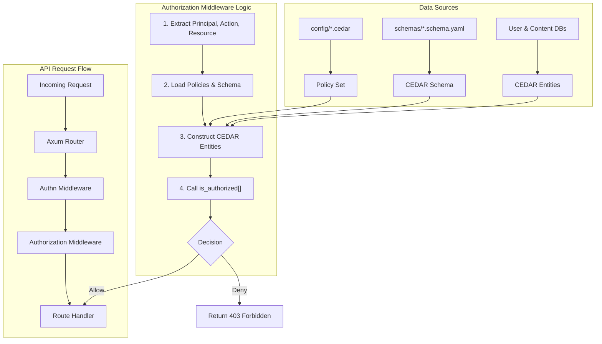

# CEDAR Authorization Implementation Plan

This document outlines the plan to integrate the [CEDAR](https://www.cedarpolicy.com/) policy language for fine-grained authorization within the Marain CMS. This will replace the basic RBAC placeholder and provide a more powerful and flexible authorization model.

## 1. Core Objectives

-   **Integrate CEDAR:** Use the `cedar-policy` Rust crate to create a robust authorization engine.
-   **Policy as Code:** Store CEDAR policies in `.cedar` files within the `/config` directory, enabling hot-reloading.
-   **Dynamic Entities:** Represent CMS content types, users, and roles as CEDAR entities.
-   **Hierarchical Roles:** Support dynamic group hierarchies stored in the database for flexible permission modeling.
-   **Schema-Driven Policies:** Allow entity schemas (`.schema.yaml`) to contain authorization-related metadata.

## 2. CEDAR Integration Architecture

We will introduce a new `authz` crate and an `AuthorizationMiddleware` to handle policy decisions.

### 3. Implementation Tasks (Revised)

The implementation is broken down into four distinct stages, moving from a basic, static proof-of-concept to a fully dynamic, schema-driven authorization system. Each stage includes specific, testable tasks.

```mermaid
graph TD
    subgraph Stage 1: Foundational Crate & Static PoC
        A1["1.1: Create `authz` crate & add dependencies"] --> A2["1.2: Define core static data structures in `types.rs`"]
        A2 --> A3["1.3: Impl `AuthzEngine` with a hardcoded policy and entities"]
        A3 --> A4["1.4: Write unit tests for `AuthzEngine` with hardcoded data"]
    end

    subgraph Stage 2: Basic Dynamic Integration
        B1["2.1: Replace `auth_middleware` stub with basic `AuthorizationMiddleware`"] --> B2["2.2: Implement basic `Principal`, `Action`, `Resource` extraction from request"]
        B2 --> B3["2.3: Integrate `AuthzEngine` into middleware, using the hardcoded PoC Logic"]
        B3 --> B4["2.4: Write integration tests for middleware with hardcoded PoC"]
    end

    subgraph Stage 3: Schema-Driven Dynamic Authorization
        C1["3.1: Modify `schema-manager` to load `.cedar` files"] --> C2["3.2: Enhance `schema-manager` to generate a CEDAR Schema from YAML schemas"]
        C2 --> C3["3.3: Implement dynamic entity construction from DB and User data"]
        C3 --> C4["3.4: Update `AuthzEngine` to use dynamic policies, schema, and entities"]
        C4 --> C5["3.5: Add `cedar` block to entity YAML schema format"]
        C5 --> C6["3.6: Create initial `config/policies.cedar` file"]
    end
    
    subgraph "Stage 4: Testing, Docs, & Finalization"
       D1["4.1: Expand unit tests for dynamic schema and entity logic"] --> D2["4.2: Expand integration tests for common policy scenarios (owner, role, public)"]
       D2 --> D3["4.3: Update `DEVELOPER-GUIDE.md` and `authorization.md`"]
       D3 --> D4["4.4: Update `AGENTS.md` with guidelines for policy management"]
    end

    A4 --> B1;
    B4 --> C1;
    C6 --> D1;
```

---

#### **Stage 1: Foundational Crate & Static Hardcoded Proof-of-Concept**

*Objective: Create the `authz` crate and a self-contained, testable authorization engine with hardcoded data. This validates the core CEDAR logic entirely in isolation.*

1.  **Task 1.1: Create `authz` Crate**
    *   **Action:** Create the new crate at `src-tauri/authz`.
    *   **Action:** Add `cedar-policy`, `serde`, `tokio`, and `thiserror` to its `Cargo.toml`.
    *   **Deliverable:** A new, empty crate that compiles successfully within the workspace.

2.  **Task 1.2: Define Core Authz Data Structures**
    *   **Action:** In `authz/src/types.rs`, define `Principal`, `Action`, and `Resource` structs. These will initially be simple wrappers around strings.
    *   **Deliverable:** Committed code for the basic data structures.

3.  **Task 1.3: Implement `AuthzEngine` with Hardcoded Logic**
    *   **Action:** In `authz/src/lib.rs`, create an `AuthzEngine` struct.
    *   **Action:** Implement a method `is_authorized_static_poc(&self, principal: &Principal, action: &Action, resource: &Resource) -> bool`.
    *   **Action:** Inside this method, hardcode a single Cedar policy string (e.g., `permit(principal, action, resource);`).
    *   **Action:** Hardcode a small set of entities (e.g., a "User::\"test_user\"" principal).
    *   **Action:** Use these hardcoded policies and entities to make an authorization decision.
    *   **Deliverable:** A functioning `AuthzEngine` that can make a decision based on entirely self-contained, hardcoded data.

4.  **Task 1.4: Write Unit Tests for Static PoC**
    *   **Action:** In the `authz` crate, create a `tests` module.
    *   **Action:** Write unit tests that call `is_authorized_static_poc` and assert `true` for allowed scenarios and `false` for denied ones, based on the hardcoded policy.
    *   **Deliverable:** A passing test suite (`cargo test` in `src-tauri/authz`) that validates the hardcoded logic.

---

#### **Stage 2: Basic Dynamic Integration**

*Objective: Integrate the `AuthzEngine` into the API middleware. This stage will still use the hardcoded policies and entities from Stage 1 to prove the middleware flow works before adding dynamic data loading.*

1.  **Task 2.1: Replace Auth Middleware Stub**
    *   **Action:** In `src-tauri/api/src/middleware_hooks.rs`, remove the placeholder logic in `auth_middleware` and rename it to `authorization_middleware`.
    *   **Action:** Instantiate `AuthzEngine`.
    *   **Deliverable:** The middleware is correctly registered in the Axum router, replacing the old one.

2.  **Task 2.2: Implement Basic Request Data Extraction**
    *   **Action:** In the middleware, implement logic to extract a placeholder user principal (can be hardcoded initially), the action (from the HTTP method), and the resource (from the URI path).
    *   **Action:** Construct the `Principal`, `Action`, and `Resource` structs from this data.
    *   **Deliverable:** The middleware can successfully parse request data into the required authz structs.

3.  **Task 2.3: Integrate `AuthzEngine` into Middleware**
    *   **Action:** Call the `AuthzEngine::is_authorized_static_poc()` method from within the middleware using the extracted request data.
    *   **Action:** On `true`, pass the request to `next.run(request)`.
    *   **Action:** On `false`, return a `403 Forbidden` response.
    *   **Deliverable:** The application now performs a basic authorization check on incoming requests.

4.  **Task 2.4: Write Middleware Integration Tests**
    *   **Action:** In the `api` crate, create integration tests that send mock requests through the `authorization_middleware`.
    *   **Action:** Test that requests matching the hardcoded PoC policy are allowed, and others are denied with a 403 status code.
    *   **Deliverable:** A passing test suite (`cargo test` in `src-tauri/api`) that validates the middleware flow.

---

#### **Stage 3: Schema-Driven Dynamic Authorization**

*Objective: Replace all hardcoded elements with dynamically loaded policies, schemas, and entities from the file system and database.*

1.  **Task 3.1: Implement Policy Loading**
    *   **Action:** Modify the `schema-manager` crate to watch for `.cedar` files in the `config/` directory.
    *   **Action:** The `schema-manager` should parse all `.cedar` files into a single `cedar_policy::PolicySet`.
    *   **Deliverable:** The `schema-manager` can successfully load and validate policies from disk.

2.  **Task 3.2: Implement CEDAR Schema Generation**
    *   **Action:** In `schema-manager`, add logic to transform the existing YAML entity schemas into a CEDAR schema JSON format.
    *   **Deliverable:** A valid CEDAR schema is generated in memory that reflects the types and attributes defined in the `.schema.yaml` files.

3.  **Task 3.3: Implement Dynamic Entity Construction**
    *   **Action:** In the `authz` crate, create functions that convert Marain users and content entities (from database lookups) into `cedar_policy::Entity` objects.
    *   **Action:** This includes fetching user roles and content attributes to populate the CEDAR entities.
    *   **Deliverable:** Functions that can take a user ID or content ID and return a fully-formed `Entity`.

4.  **Task 3.4: Update `AuthzEngine` to be Fully Dynamic**
    *   **Action:** Create a new method `is_authorized(&self, request_authz_data)` that takes the dynamic policies, schema, and constructed entities.
    *   **Action:** Replace the call to the `_static_poc` method in the middleware with this new dynamic method.
    *   **Deliverable:** The `AuthzEngine` now makes decisions using policies and data loaded from the live environment.

5.  **Task 3.5: Extend Entity Schemas for Authorization**
    *   **Action:** Add a new optional `cedar` section to the entity schema (`.schema.yaml`) format as described in the original plan.
    *   **Deliverable:** The schema parser is updated to handle the new `cedar` block.

6.  **Task 3.6: Create Initial Policies**
    *   **Action:** Create `config/policies.cedar` with initial policies for admin, content owners, and public access.
    *   **Deliverable:** A set of default policies that can be loaded by the `schema-manager`.

---

#### **Stage 4: Testing, Documentation, & Finalization**

*Objective: Thoroughly test the complete dynamic system and update all relevant documentation.*

1.  **Task 4.1: Expand Unit Tests**
    *   **Action:** In the `authz` crate, add unit tests for the dynamic entity construction logic.
    *   **Deliverable:** A robust test suite covering the transformation of Marain entities to CEDAR entities.

2.  **Task 4.2: Expand Integration Tests**
    *   **Action:** In the `api` crate, expand the integration tests to cover common scenarios with the dynamic policies:
        *   Admin access is permitted.
        *   Owner of a resource can edit it.
        *   Anonymous user can read a public resource.
        *   Non-owner cannot edit a resource.
    *   **Deliverable:** A comprehensive test suite validating the end-to-end authorization flow.

3.  **Task 4.3: Update Core Documentation**
    *   **Action:** Update `documentation/DEVELOPER-GUIDE.md` and `documentation/user-management-system/authorization.md` to reflect the new CEDAR-based system, replacing the old RBAC description.
    *   **Deliverable:** Updated and accurate documentation.

4.  **Task 4.4: Update Agent Guidelines**
    *   **Action:** Update `AGENTS.md` with clear instructions on how to create and modify `.cedar` policies.
    *   **Deliverable:** Guidelines to assist AI agents in managing authorization policies.

---

### 4. Todo List (Revised)

Here is the checklist of tasks to be performed.

- [ ] 1.1: Create `authz` crate and add dependencies.
- [ ] 1.2: Define `Principal`, `Action`, `Resource` structs in `authz` crate.
- [ ] 1.3: Implement `AuthzEngine` with a hardcoded policy and entities for a static PoC.
- [ ] 1.4: Write unit tests for the static `AuthzEngine` PoC.
- [ ] 2.1: Replace auth middleware stub with a new `AuthorizationMiddleware`.
- [ ] 2.2: Implement basic extraction of P-A-R from requests in the middleware.
- [ ] 2.3: Integrate the static PoC `AuthzEngine` into the middleware.
- [ ] 2.4: Write integration tests for the middleware using the static PoC.
- [ ] 3.1: Update `schema-manager` to load `.cedar` policies from `/config`.
- [ ] 3.2: Update `schema-manager` to generate a CEDAR schema from YAML entity schemas.
- [ ] 3.3: Implement logic to convert Marain users and content into CEDAR entities dynamically.
- [ ] 3.4: Update `AuthzEngine` to use dynamic policies, schema, and entities.
- [ ] 3.5: Update entity schema format to include an optional `cedar` block.
- [ ] 3.6: Create initial set of default `.cedar` policies in `/config`.
- [ ] 4.1: Implement comprehensive unit tests for dynamic authorization logic.
- [ ] 4.2: Implement comprehensive integration tests for common policy scenarios.
- [ ] 4.3: Update `DEVELOPER-GUIDE.md` and `authorization.md` with CEDAR implementation details.
- [ ] 4.4: Update `AGENTS.md` with guidelines for creating and modifying policies.