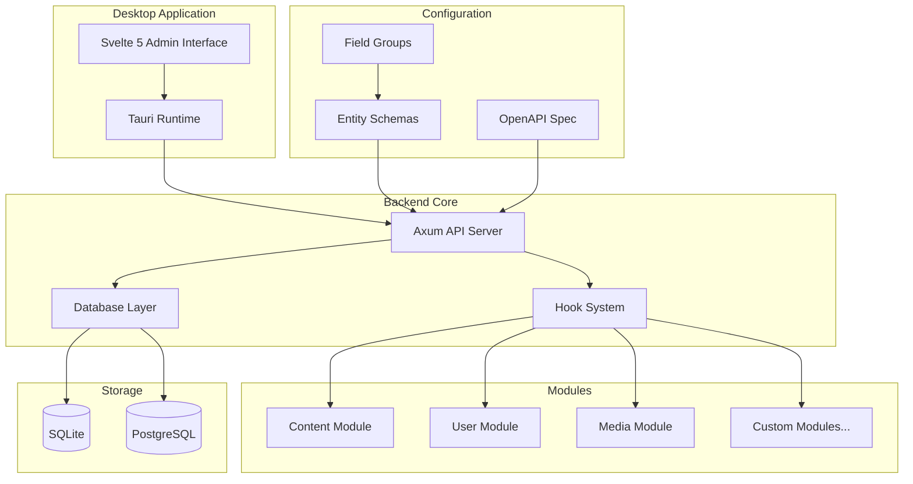
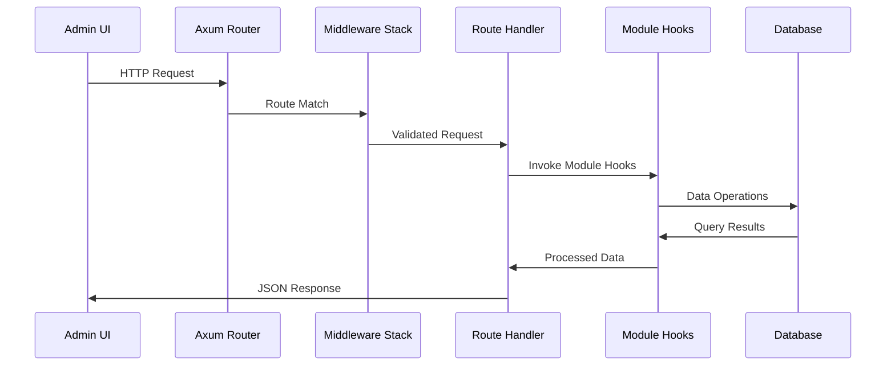

# Design Document

## Overview

Marain CMS is designed as a headless, API-first content management system with a modular architecture. The system consists of two main components: a Rust-based backend that provides a RESTful API and handles all business logic, and a Svelte 5 frontend wrapped in Tauri for desktop deployment. The architecture emphasizes developer experience through configuration-as-code principles and LLM-assisted development workflows.

The system follows a clear separation of concerns where the backend operates independently and can serve multiple frontend applications, while the desktop admin interface provides a rich user experience for content management.

## Architecture

### High-Level Architecture



### Request Flow Architecture



## Components and Interfaces

### Backend Components

#### 1. Core Application (`src-tauri/app/`)
- **Purpose**: Main Tauri application entry point and coordination
- **Key Files**:
  - `main.rs`: Application bootstrap and Tauri configuration
  - `lib.rs`: Core application logic, dependency injection, and module registration
- **Interfaces**: 
  - Exposes Tauri commands to frontend
  - Coordinates backend services through dependency injection
  - Manages application state via `AppState` struct containing database connection
- **Dependency Injection**: 
  - Database connection is initialized once and passed to all components
  -

#### 2. API Layer (`src-tauri/api/`)
- **Purpose**: HTTP API endpoints and middleware
- **Key Files**:
  - `lib.rs`: API router setup and middleware configuration
  - `handlers/`: Individual endpoint handlers organized by resource
  - `middleware/`: Custom middleware for authentication, validation, CORS
  - `test_handlers/`: Development-only test endpoints (excluded from production builds)
- **Interfaces**: Versioned RESTful HTTP API (`/api/v1/`) conforming to OpenAPI specification

#### 3. Database Layer (`src-tauri/database/`)
- **Purpose**: Database abstraction and data persistence
- **Key Files**:
  - `lib.rs`: Database connection management and configuration
  - `models/`: Data models and entity representations
  - `migrations/`: Database schema migrations
- **Interfaces**: SQLx-based database operations with support for SQLite and PostgreSQL

#### 4. Entity System (`src-tauri/entities/`)
- **Purpose**: Business logic for content types and entity management
- **Key Files**:
  - `lib.rs`: Entity trait definitions and core logic
  - `schema_loader.rs`: YAML schema parsing and validation
  - `entity_manager.rs`: Entity CRUD operations and relationships
- **Interfaces**: Entity trait for consistent entity behavior across modules

#### 5. Field System (`src-tauri/fields/`)
- **Purpose**: Field type definitions and validation logic
- **Key Files**:
  - `lib.rs`: Field trait and primitive field types
  - `primitive.rs`: Basic field types (text, integer, boolean, etc.)
  - `complex.rs`: Complex field types (component, entity_reference)
  - `validation.rs`: Field validation and constraint enforcement
- **Interfaces**: Field trait for extensible field type system

#### 6. Module System (`src-tauri/modules/`)
- **Purpose**: Extensible module architecture
- **Structure**: Each module as separate crate with:
  - `lib.rs`: Module registration and hook implementations
  - `api.rs`: Module-specific API handlers
  - `schemas/`: Directory containing YAML entity schemas that the module provides
    - Entity schemas are embedded in the module binary
    - Automatically copied to system `/schemas` directory when module is enabled
    - Enables hot-reload system to pick up and implement entities
- **Interfaces**: Module trait for consistent module behavior and hook system

### Frontend Components

#### 1. Admin Interface (`src/`)
- **Purpose**: Desktop application for content management
- **Key Files**:
  - `app.html`: Main application template
  - `routes/`: SvelteKit routing and page components
  - `lib/`: Shared utilities and API client
  - `modules/`: Frontend module components
- **Interfaces**: Tauri commands for backend communication, component-based architecture

### Configuration Components

#### 1. Schema System (`schemas/`)
- **Purpose**: Runtime entity and field group definitions
- **Structure**:
  - YAML files defining content types and reusable field groups
  - Populated by modules when they are enabled
  - Modules contain their own schema files that are copied here
  - Hot-reload system monitors this directory for changes
- **Interfaces**: Standardized YAML schema format for entity definitions

#### 2. API Specification (`openapi.yaml`)
- **Purpose**: Single source of truth for API contract
- **Structure**: OpenAPI 3.0 specification with all endpoints documented under `/api/v1/` prefix
- **Test Endpoints**: Development-only endpoints under `/api/v1/test/` for testing and debugging
- **Interfaces**: Standard OpenAPI format for API documentation and validation

## Data Models

### Entity Schema Structure

```yaml
# Entity Definition
id: string              # Unique identifier
name: string           # Human-readable name
description: string    # Optional description
recursive: boolean     # Whether to pull in referenced entities
cacheable: boolean     # Whether entity can be cached
fields: Field[]        # Array of field definitions
```

### Field Definition Structure

```yaml
# Field Definition
id: string             # Unique field identifier
type: string          # Field type (primitive or complex)
label: string         # Human-readable label
required: boolean     # Whether field is mandatory
description: string   # Optional description
cardinality: number   # Number of values (-1 for unlimited)
# Type-specific properties
target_entity: string # For entity_reference fields
fields: Field[]       # For component fields
```

### Database Schema

The system uses a structured, entity-centric approach to database schema design, where each entity is mapped to its own set of tables. This provides strong typing, improved query performance, and better data integrity compared to a generic JSON-based approach.

- **Entity-Specific Tables**: Each entity has its own table, named `content_<entity_id>`, which stores all single-value fields as columns.
- **Multi-Value Field Tables**: Fields with a cardinality other than 1 are stored in separate tables, named `field_<entity_id>_<field_id>`, to handle one-to-many relationships.
- **Indexing**: Indexes are automatically created for commonly queried fields, such as slugs and foreign keys, to ensure optimal performance.
- **Data Integrity**: The use of foreign key constraints and appropriate data types ensures that the data remains consistent and valid.

```sql
-- Example for an 'article' entity
CREATE TABLE content_article (
    id TEXT PRIMARY KEY,
    title TEXT NOT NULL,
    slug TEXT NOT NULL UNIQUE,
    body TEXT,
    author TEXT, -- Foreign key to user entity
    created_at TIMESTAMP DEFAULT CURRENT_TIMESTAMP,
    updated_at TIMESTAMP DEFAULT CURRENT_TIMESTAMP
);

-- Example for a multi-value 'tags' field on the 'article' entity
CREATE TABLE field_article_tags (
    id TEXT PRIMARY KEY,
    parent_id TEXT NOT NULL,
    value TEXT NOT NULL,
    sort_order INTEGER,
    FOREIGN KEY (parent_id) REFERENCES content_article(id) ON DELETE CASCADE
);
```

## Logging

### Backend Logging (Rust)

The backend uses the `tracing` crate for structured logging, providing comprehensive observability across all system components.

1. **Tracing Setup**:
   - Hierarchical spans for request tracing
   - Structured logging with contextual information
   - Multiple output formats (JSON for production, pretty for development)
   - Log level configuration via environment variables

2. **Logging Levels**:
   - `ERROR`: System errors and failures
   - `WARN`: Recoverable issues and deprecation warnings
   - `INFO`: General application flow and important events
   - `DEBUG`: Detailed debugging information
   - `TRACE`: Very detailed execution traces

3. **Logging Components**:
   - **Request Tracing**: Each HTTP request gets a unique span
   - **Database Operations**: Query logging with execution times
   - **Module Operations**: Module-specific logging with context
   - **Error Context**: Detailed error chains with full context

4. **Log Format**:
```rust
// Example structured log entry
tracing::info!(
    user_id = %user.id,
    entity_type = %entity.type_name,
    operation = "create",
    duration_ms = %duration.as_millis(),
    "Entity created successfully"
);
```

### Frontend Logging (Svelte)

The frontend uses `loglevel` for client-side logging with appropriate log levels for different environments.

1. **Log Level Configuration**:
   - Development: `DEBUG` level for detailed debugging
   - Production: `WARN` level to minimize noise
   - Testing: `ERROR` level for test clarity

2. **Logging Categories**:
   - **API Calls**: Request/response logging with timing
   - **User Actions**: User interaction tracking
   - **Component Lifecycle**: Component mount/unmount events
   - **Error Handling**: Client-side error reporting

3. **Log Format**:
```javascript
// Example frontend logging
import log from 'loglevel';

log.info('API Request', {
    endpoint: '/api/v1/entities',
    method: 'POST',
    timestamp: new Date().toISOString()
});
```

### Logging Integration

1. **Correlation IDs**: Requests include correlation IDs to trace across frontend and backend
2. **Performance Monitoring**: Request timing and performance metrics
3. **Error Correlation**: Link frontend errors with backend error traces
4. **Development Tools**: Enhanced logging in development mode for debugging

## Error Handling

### Backend Error Handling

1. **Structured Error Types**: Custom error enums for different error categories
   - `ApiError`: HTTP-related errors with appropriate status codes
   - `DatabaseError`: Database operation failures
   - `ValidationError`: Schema and data validation failures
   - `ModuleError`: Module-specific errors

2. **Error Middleware**: Centralized error handling middleware that:
   - Logs errors appropriately
   - Converts internal errors to appropriate HTTP responses
   - Maintains error context for debugging

3. **Error Response Format**:
```json
{
  "error": {
    "code": "VALIDATION_FAILED",
    "message": "Field validation failed",
    "details": {
      "field": "title",
      "constraint": "required"
    }
  }
}
```

### Frontend Error Handling

1. **API Error Handling**: Centralized error handling for API responses
2. **User Feedback**: Toast notifications and form validation messages
3. **Error Boundaries**: Svelte error boundaries to prevent application crashes
4. **Offline Handling**: Graceful degradation when backend is unavailable

## Testing Strategy

### Backend Testing

1. **Unit Tests**: 
   - Individual function and method testing
   - Mock dependencies for isolated testing
   - Coverage requirements: >80% for core modules

2. **Integration Tests**:
   - API endpoint testing with real database
   - Module interaction testing
   - Schema validation testing

3. **Database Tests**:
   - Migration testing
   - Data integrity testing
   - Performance testing for complex queries

### Frontend Testing

1. **Component Tests**:
   - Individual Svelte component testing
   - Props and event handling validation
   - Accessibility testing

2. **End-to-End Tests**:
   - Playwright tests for complete user workflows
   - Cross-browser compatibility testing
   - Performance testing for large datasets

3. **Integration Tests**:
   - Frontend-backend communication testing
   - Tauri command testing
   - Error scenario testing

### Testing Infrastructure

1. **Test Database**: Separate SQLite database for testing
2. **Mock Services**: Mock external dependencies
3. **Test Data**: Fixtures and factories for consistent test data
4. **CI/CD Integration**: Automated testing in build pipeline

### Manual Testing Requirements

Each development task must include:
1. **Manual Test Plan**: Step-by-step instructions for manual verification
2. **Admin UI Testing**: Preference for testing through the admin interface
3. **CLI Fallback**: Command-line testing when UI testing isn't feasible
4. **Documentation**: Test results and any issues discovered
5. **Automated Test Creation**: Convert manual test failures into automated tests

## API Architecture

### Versioning Strategy
- All production API endpoints use `/api/v1/` prefix for version 1
- Future versions will use `/api/v2/`, `/api/v3/`, etc.
- Version-specific routing allows for backward compatibility

### Test Endpoints
- Development-only endpoints available under `/api/v1/test/`
- Test endpoints provide simple connectivity and functionality verification
- Excluded from production builds using conditional compilation
- Examples: `/api/v1/test/hello`, `/api/v1/test/database`, `/api/v1/test/modules`

### Endpoint Structure
```
/api/v1/
├── entities/          # Entity CRUD operations
├── schemas/           # Schema management
├── modules/           # Module-specific endpoints
├── health/            # System health checks
└── test/              # Development-only test endpoints
    ├── hello          # Basic connectivity test
    ├── database       # Database connection test
    └── modules        # Module loading test
```

## Development Workflow

### LLM-Assisted Development Process

1. **Specification First**: Always update OpenAPI spec or schema files before code
2. **Code Generation**: Generate code based on updated specifications
3. **Test Generation**: Create corresponding tests for all new functionality
4. **Verification**: Run all verification commands to ensure quality

### Verification Commands

- **Full Stack Development**: `bun run tauri dev`
- **Backend Testing**: `cd src-tauri && cargo test && cargo fmt && cargo clippy -- -D warnings`
- **Frontend Testing**: `bun run playwright test`

### Module Development Pattern

1. Create module directory structure
2. Define module schemas in module's `schemas/` directory (if providing entities)
   - Schemas are embedded in the module crate
   - Automatically deployed to system `/schemas` when module is enabled
3. Implement module trait and hooks
4. Add API handlers and update OpenAPI spec
5. Create frontend components (if needed)
6. Write comprehensive tests
7. Update documentation

### Module Schema Management

Modules that provide entities must:
1. Store YAML schema files within the module crate (e.g., `src-tauri/modules/content/schemas/`)
2. Embed schemas in the binary at compile time
3. Implement schema copying logic when module is enabled
4. The system automatically copies schemas to `/schemas` directory for hot-reload processing

### Configuration Management

The application utilizes a globally accessible, in-memory configuration store that is populated from YAML files at startup. This system is designed for high performance and flexibility, allowing for runtime overrides and type-safe access to configuration values.

- **Global Access**: A `CONFIG` lazy static provides thread-safe, read-only access to all configuration properties.
- **Type-Safe**: Configuration values are strongly typed, preventing common parsing errors.
- **Schema-Manager**: The system supports hot-reloading of configuration files through the schema-manager, allowing for dynamic updates without restarting the application.

### System Globals

The Marain architecture relies on a set of globally accessible data structures that are initialized at startup and provide consistent, thread-safe access to core system components.

#### `entity_definitions`: The Global Entity Vector
All entities in the system are loaded from YAML schema files into a globally accessible `Vec<Box<dyn Entity>>` called `entity_definitions`. This vector serves as the single source of truth for all available entities and their properties.

- **Dynamic Dispatch**: The use of trait objects (`Box<dyn Entity>`) allows a heterogeneous collection of entity types to be managed in a unified manner.
- **Schema-Manager Target**: This vector is the primary target of the schema-manager system. When entity schemas are modified, this vector is updated.
- **Centralized Management**: Centralizing entity definitions ensures that all modules and services are working with the same set of entities.

#### `CONFIG`: The Global Configuration Store
All system configurations are loaded into a globally accessible, in-memory key-value store named `CONFIG`.

- **Type-Safe Access**: The `CONFIG` store provides methods for retrieving configuration values with their correct types.
- **Layered Configuration**: The system supports multiple configuration sources which are merged into a single `CONFIG` store.
- **Performance**: The in-memory nature of the `CONFIG` store ensures high-performance access to configuration values.