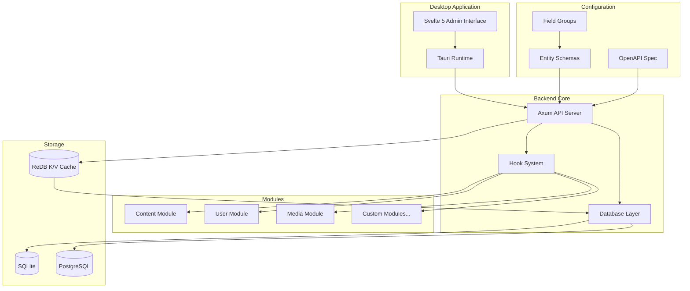
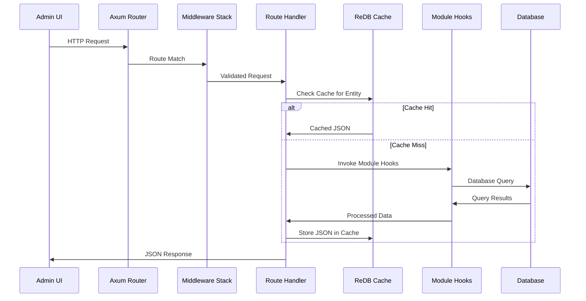

# Marain CMS: Developer Guide

This guide serves as the comprehensive technical reference for the Marain CMS project. It is intended for developers and advanced users who need to understand the system's architecture, data models, and development workflows.

---

## 1. Core Principles & Requirements

Marain is a headless, API-first content management system designed with modularity and configuration-as-code principles. The system consists of a Rust-based backend providing a RESTful API and a Svelte 5 frontend wrapped in Tauri for desktop deployment.

### Key Requirements:
- **Headless API**: The system MUST expose a versioned RESTful API, allowing it to operate independently of any frontend.
- **Desktop Admin UI**: A Tauri-wrapped Svelte 5 application WILL serve as the primary content management interface.
- **Modular Architecture**: Functionality MUST be extensible through self-contained Rust crates (modules) without modifying core code.
- **Configuration-as-Code**: All site structure, content types (entities), and configurations MUST be defined in version-controlled YAML files, enabling automated deployment and hot-reloading.
- **Flexible Content Modeling**: The system MUST support primitive types, nested components, and entity references to create complex, structured content.
- **Comprehensive Testing**: All backend code MUST have corresponding Rust unit tests, and frontend components MUST have Playwright E2E tests.
- **Database Flexibility**: The system MUST support SQLite for local development and PostgreSQL for production environments.
- **LLM-Assisted Workflow**: The development process is designed to be assisted by LLMs, requiring that API and schema definitions are updated *before* code generation.

---

## 2. System Architecture

The architecture separates the frontend, backend, and configuration into distinct layers, ensuring a clean separation of concerns.

### High-Level Diagram



### Backend & Frontend Stacks

-   **Backend (Rust)**: Tokio, SQLx, Axum, Tower, Utoipa, ReDB.
-   **Frontend (Svelte)**: Svelte 5, Bun, Tauri.

---

## 3. Directory & Crate Structure

- **`src/`**: Svelte 5 frontend application.
- **`src-tauri/`**: Rust-based backend, structured as a Cargo workspace.
    - `api/`: API endpoints, middleware, and OpenAPI generation.
    - `app/`: Main Tauri application, entry point, and UI coordination.
    - `content/`: Common content-related utilities (hashing, sanitization, bulk ops).
    - `database/`: Database abstraction, connection management, and persistence.
    - `entities/`: Logic for content types, schema loading, and entity traits.
    - `fields/`: Field type definitions and validation logic.
    - `json-cache/`: High-performance key-value caching using ReDB.
    - `schema-manager/`: Monitors `config/` and `schemas/` for hot-reloading.
    - `user/`: User authentication, session management, and secure logging.
- **`config/`**: YAML configuration files (e.g., `config.system.dev.yaml`).
- **`schemas/`**: Runtime entity and field group YAML schemas.
- **`data/`**: Runtime data (logs, databases, cache files).

---

## 4. API & Request Lifecycle

The system's core is the Axum-based RESTful API. The request flow is designed for performance and extensibility.

### API Request Flow



1.  **Request & Routing**: A request hits the Axum server and is routed to a handler.
2.  **Middleware**: The request passes through layers for logging, auth, and validation.
3.  **Cache Check**: The handler first checks the ReDB cache for the requested content.
4.  **Database Fetch (on Cache Miss)**: If not cached, data is fetched from the database, processed by module hooks, and then stored in the cache.
5.  **Response**: The final JSON response is sent to the client.

### API Specification (`openapi.yaml`)

- The **single source of truth** for the API, located in the project root.
- All API development **must start** with a change to this file.
- Used by LLMs to understand endpoints and by tooling for validation.

---

## 5. Data Modeling & Storage

### Entities and Schemas

Content types, called **Entities**, are defined in YAML files in `schemas/`.

**Example: `schemas/article.schema.yaml`**
```yaml
id: article
name: Article
description: A news article or blog post.
versioned: true      # Enables content versioning for this entity
recursive: false     # If true, resolves nested entity references
cacheable: true      # If false, entity is never cached
fields:
  - id: title
    type: text
    required: true
    label: Title
  - id: body
    type: rich_text
    label: Body Content
  - id: author
    type: entity_reference
    target_entity: user
    label: Author
```

### Fields
Fields define the structure of an entity. Key types include:
- **Primitives**: `text`, `long_text`, `rich_text`, `integer`, `float`, `boolean`, `datetime`, `slug`.
- **`component`**: A container for nesting other fields.
- **`entity_reference`**: Creates a relationship to another entity.
- **Field Groups**: Reusable sets of fields defined in their own schema files.

### Database Schema

The database schema is **dynamically generated** from the YAML entity definitions.

- **Entity Tables**: Each entity has a main table named `content_{entity_id}`.
- **Multi-Value Fields**: Fields with `cardinality: -1` are stored in separate `field_{entity_id}_{field_id}` tables.
- **Revision Tables**: If `versioned: true`, corresponding `content_revisions_{...}` and `field_revisions_{...}` tables are created to store historical versions.
- **Default Columns**: All tables automatically include:
    - `id` (ULID): The primary key.
    - `rid` (Integer): The revision ID, incremented on each update.
    - `user` (Text ULID): The ULID of the user who made the change (defaults to "00000000000000000000000000" for system).
    - `content_hash` (Text): SHA256 hash of the content for change detection.
    - `last_cached` (Timestamp): When the item was last cached.
    - `cache_ttl` (Integer): Time-to-live in seconds for the cache entry.

### Caching Layer (ReDB)

A high-performance K/V cache (`data/json-cache/`) stores fully resolved entities as JSON objects to minimize database queries.
- **Keys**: `{entity_type}:{content_id}`
- **Invalidation**: Based on TTL and content hash changes.
- **Persistence**: ReDB is a persistent on-disk store.

---

## 6. Critical Path configurations & Development Workflow

Certain configurations are critical to system stability and developer productivity.

### Critical File Locations

- **Environment Config**: `.env` and `EXAMPLE.env` in the project root define all base paths.
- **Logs**: Must be in `{DATA_PATH}/logs/` to prevent infinite hot-reload loops.
- **Databases**:
    - **Content**: `{DATA_PATH}/content/marain.db`
    - **User**: `{DATA_PATH}/user-backend/marain_user.db`
    - **Cache**: `{DATA_PATH}/json-cache/marain_json_cache.db`
- **Watched Directories**: The `schema-manager` watches `{CONFIGURATION_PATH}` and `{ENTITY_SCHEMA_PATH}` for changes. **Do not** place frequently changing files (like logs) in these directories.
    - **Tauri HMR Directories**: The `src/*` directory and `src-tauri/*` directory are watched for file changes by the Tauri framework for hot module reloading, we cannot place any files in these directories either or we will break the runtime.

### ULID vs. UUID Bridge
The system standardizes on **ULIDs** for all internal IDs due to their sortable nature. However, the `webauthn-rs` library requires `UUIDs`.
- A conversion bridge exists in [`src-tauri/user/src/ulid_uuid_bridge.rs`](src-tauri/user/src/ulid_uuid_bridge.rs).
- **Rule**: Use ULIDs everywhere except when interfacing directly with `webauthn-rs`. Use the bridge to convert a ULID to a UUID at the boundary.

### LLM-Assisted Development Workflow

1.  **Specify Change**: Clearly define the feature or bugfix.
2.  **Update API/Schema First**:
    -   API changes: **Must** update `openapi.yaml` first.
    -   Content model changes: **Must** create/update a `.schema.yaml` file first.
3.  **Generate Code**: Use the updated spec/schema to generate Rust and/or Svelte code.
4.  **Generate Tests**: Generate corresponding tests (Rust unit tests or Playwright E2E tests).
5.  **Verify with Tooling**: Run all verification commands.

### **Verification Commands**

-   **Full Stack (Dev Mode):** `bun run tauri dev`
-   **Backend (Rust):** `cd src-tauri && cargo test && cargo fmt && cargo clippy --all -- -D warnings`
-   **Frontend (E2E Tests):** `bun run playwright test`