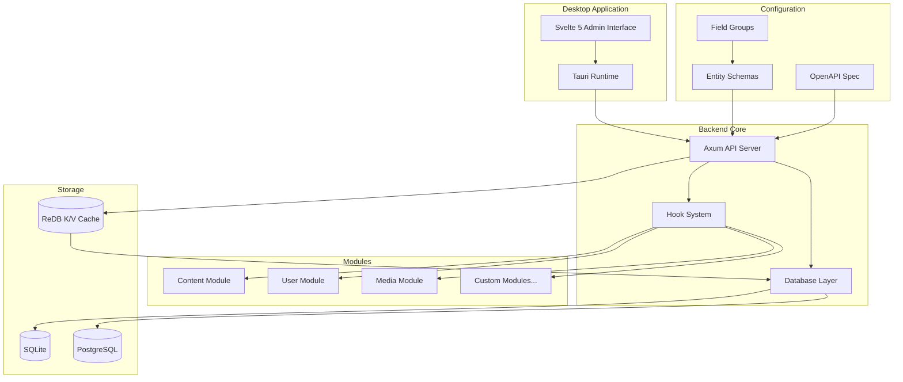
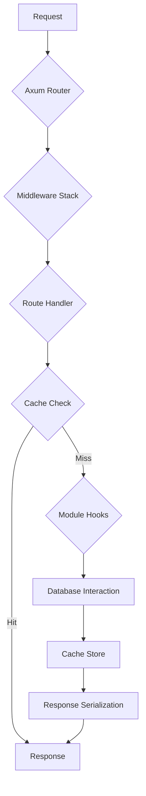
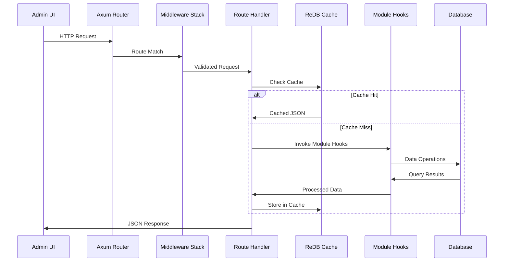

# MARAIN CMS Architecture

This document outlines the headless, API-first architecture of Marain CMS. It is designed to guide developers and LLM assistants in building and extending the system.
### High-Level Architecture



## Core Principles

1.  **API-First:** The core of Marain is a headless system accessible via a versioned RESTful API. All frontend experiences and integrations are consumers of this API.
2.  **Modular:** Functionality is encapsulated in self-contained modules.
3.  **Configuration as Code:** Site structure, including content types (entities) and modules, is defined in version-controlled files, enabling automated deployment and LLM-assisted scaffolding.

## Frontend Stack

The Marain admin interface is a Sveltekit style Tauri framework built with the following technologies:

*   **Framework**: Svelte 5 (using plain JavaScript, not TypeScript)
*   **Build Tool / Dev Server**: Bun
*   **Desktop Wrapper**: Tauri

## Backend Stack

The Marain core is written in Rust it can operate independently of the frontend, built with the following technologies:

*   **tokio**: Async runtime
*   **sqlx**: SQL abstraction layer
*   **axum**: API server
*   **tower**: HTTP toolkit, API middleware
*   **utoipa**: Auto generate OpenAPI documentation
*   **sqlite**: Database default
*   **postgres**: Remote database (optional)

## Directory Structure

*   `src/`: Contains the Svelte 5 frontend application source code.
*   `src/routes`: Contains the +page and +layout files for different pages
*   `src/lib`: Contains the common javascript library functions
*   `src/modules`: Contains the Svelte 5 modules
*   `src-tauri/`: Contains the Rust-based core application logic, structured as a Cargo workspace for modularity. This organization helps LLM agents navigate and extend the backend efficiently.
    *   `Cargo.toml`: Defines the workspace members (e.g., `app`, `api`, `database`, `entities`, `fields`, `schema-manager`, `json-cache`).
    *   `app/`: The main Tauri application crate and entry point.
    *   `api/`: Crate for API endpoints and middleware, defined by `openapi.yaml`.
    *   `database/`: Crate for database connections, storage operations, and data persistence.
    *   `entities/`: Standalone crate for entity definitions, schema loading, and entity-related business logic.
    *   `fields/`: Standalone crate for field type definitions, validation, and field-related utilities.
    *   `schema-manager/`: Crate for monitoring configuration and schema changes with automatic reloading.
    *   `json-cache/`: Crate for high-performance K/V caching using ReDB.
    *   `modules/`: Contains all functional modules, each as a separate crate.
        *   `{module_name}/`
            *   `Cargo.toml`
            *   `src/lib.rs`: Module registration and hooks.
            *   `src/api.rs`: Module-specific API handlers.
            *   `src/schemas.rs`: Embedded YAML schemas as string constants.
            *   `schemas/`: (Optional) Directory containing YAML entity schemas that the module provides.
                *   Entity schemas are embedded in the module binary at compile time.
                *   Automatically copied to system `/schemas` directory when module is enabled.
                *   Enables schema-manager system to pick up and implement entities.
*   `schemas/`: Runtime directory for entity and field group schemas.
    *   Populated by modules when they are enabled.
    *   Monitored by schema-manager system for changes.
    *   Modules contain their own schema files that are copied here.
*   `config/`: Module configuration files.
    *   `config.MODULE_NAME.yaml`: Configuration for each module (e.g., config.content.yaml).
    *   Contains module name, version, and activation status.
    *   Managed by users and committed to version control.
*   `data/`: Contains runtime data files.
    *   `content/marain.db`: SQLite database file (when using SQLite).
    *   `json-cache/marain_json_cache.db`: ReDB cache database for fast entity retrieval.
    *   `logs/`: Application log files.
    *   `work-queue/`: Future work queue storage.
    *   `user-backend/`: Future user backend storage.
*   `tests/`: Contains Playwright end-to-end tests.
    *   `e2e/`: End-to-end tests for the admin UI.
*   `openapi.yaml`: The OpenAPI 3.0 specification for the system API.

## Request Lifecycle Flow Diagram (API)

The API is built using the [Axum](https://github.com/tokio-rs/axum) web framework with an integrated caching layer.



1.  **Request:** An HTTP request is received by the Axum server.
2.  **Axum Router:** Axum's router matches the request's URI and method to a specific route handler.
3.  **Middleware Stack (Layers):** The request passes through a series of middleware layers. These can include logging, CORS, authentication, and validation against the OpenAPI spec. Middleware can modify the request or return a response early.
4.  **Route Handler:** The specific function associated with the matched route is executed. This handler contains the core logic for the endpoint.
5.  **Cache Check:** For read operations, the handler first checks the ReDB cache using the entity key.
6.  **Cache Hit:** If found and not expired, the cached JSON is returned directly.
7.  **Module Hooks:** On cache miss, the handler invokes hooks, allowing modules to interact with the request, process data, or trigger side effects.
8.  **Database Interaction:** The relevant module logic interacts with the database to retrieve or persist data.
9.  **Cache Store:** Retrieved data is serialized to JSON and stored in the cache with TTL.
10. **Response Serialization:** The handler's return value is serialized into a JSON response.
11. **Response:** The serialized JSON response is sent back to the client.

### Request Flow Architecture Step Diagram



## Configuration Management
The application utilizes a globally accessible, in-memory configuration store that is populated from YAML files at startup. This system is designed for high performance and flexibility, allowing for runtime overrides and type-safe access to configuration values.

- **Global Access**: A `CONFIG` lazy static provides thread-safe, read-only access to all configuration properties.
- **Type-Safe**: Configuration values are strongly typed, preventing common parsing errors.
- **Hot-Reload**: The system supports schema-managering of configuration files, allowing for dynamic updates without restarting the application.

For a detailed explanation of the configuration system, see the [Configuration Management System](./configuration-management-system/configuration-management-system.md) document.

## System Globals

The Marain architecture relies on a set of globally accessible data structures that are initialized at startup and provide consistent, thread-safe access to core system components.

### `entity_definitions`: The Global Entity Vector
All entities in the system are loaded from YAML schema files into a globally accessible `Vec<Box<dyn Entity>>` called `entity_definitions`. This vector serves as the single source of truth for all available entities and their properties.

- **Dynamic Dispatch**: The use of trait objects (`Box<dyn Entity>`) allows for dynamic dispatch, enabling the system to manage a heterogeneous collection of entity types in a unified manner.
- **Hot-Reload Target**: This vector is the primary target of the schema-manager system. When entity schemas are modified, this vector is updated to reflect the changes, ensuring that the entire application has access to the most current entity definitions.
- **Centralized Management**: By centralizing entity definitions, the system simplifies entity management and ensures that all modules and services are working with the same set of entities.

For more details on the entity management strategy, refer to the [Entity Management](./entity-management-system/entity-management.md) document.

### `CONFIG`: The Global Configuration Store
All system configurations are loaded into a globally accessible, in-memory key-value store named `CONFIG`. This store provides a unified and type-safe interface for accessing configuration properties throughout the application.

- **Type-Safe Access**: The `CONFIG` store provides methods for retrieving configuration values with their correct types, reducing the risk of runtime errors.
- **Layered Configuration**: The system supports multiple configuration sources (e.g., default files, user overrides, environment variables), which are merged into a single `CONFIG` store.
- **Performance**: The in-memory nature of the `CONFIG` store ensures high-performance access to configuration values with minimal contention.

This centralized approach to configuration management simplifies the process of updating and accessing system settings while maintaining a high degree of reliability and performance.

## Key Components

### API Specification (`openapi.yaml`)

This is the single source of truth for the Marain API. All API development must begin with a change to this file.

*   **LLM Interaction:** The LLM will use this file to understand API capabilities and generate correct requests and responses.
*   **Tooling:** Use tools like `swagger-cli` to validate the spec.

### Entities & Schemas

Entities (content types) are defined in YAML files within the `schemas/` directory.

An entity definition is a YAML object with the following core properties:

*   `id`: A unique machine name for the Entity, always has `_entity` appended to it (e.g. `article_entity`)
*   `type`: The data type of the field. See "Field Types" below.
*   `label`: A human-readable label for the field used in user interfaces (e.g. "Article").
*   `description`: (Optional) A description of the field for content editors.
*   `cacheable`: If the entity is cachable or always dyanimcally queried, defaults to `true`.
*   `recursive`: If the entity pulls in any external references or just embeds the reference (overridable by fields), defaults to `false`.

**Example: `schemas/article.schema.yaml`**
```yaml
id: article
name: Article
description: A news article or blog post.
recursive: false # Recursive entities may include other entity references that are pulled in
cacheable: true # Entities that are not cachable are always dynamically queried
fields:
  - id: title
    type: text
    required: true
    label: Title
  - id: slug
    type: slug
    required: true
    label: URL Slug
  - id: body
    type: rich_text
    label: Body Content
  - id: author
    type: entity_reference
    target_entity: user
    label: Author
```

*   **LLM Interaction:** To create a new content type, the LLM will generate a new schema file.

### Fields

Fields are the building blocks of entities and are defined within the `fields` array in an entity's schema file. The field system is designed to be highly flexible, allowing for nested data structures, reusable field groups, and complex relationships.

A field definition is a YAML object with the following core properties:

*   `id`: A unique machine name for the field (e.g., `field_hero_image`).
*   `type`: The data type of the field. See "Field Types" below.
*   `label`: A human-readable label for the field used in user interfaces.
*   `required`: (Optional) A boolean indicating if the field is mandatory. Defaults to `false`.
*   `description`: (Optional) A description of the field for content editors.
*   `cardinality`: (Optional) The number of values the field can hold. Defaults to `1`. Use `-1` for unlimited.

#### Field Types

Marain supports a set of primitive field types:

*   `text`: A single line of plain text.
*   `long_text`: A multi-line block of plain text.
*   `rich_text`: A block of formatted text (e.g., HTML).
*   `integer`: A whole number.
*   `float`: A floating-point number.
*   `boolean`: A true/false value.
*   `datetime`: A date and time.
*   `slug`: A URL-friendly identifier.

#### Complex Data Structures

More complex structures are achieved using special field types and by nesting field definitions.

**1. Field Nesting (Component Fields)**

To group related fields, you can define a field of type `component`. A component is not a data type itself but a container for other fields. This allows for arbitrary nesting.

**Example: A nested "SEO" component**
```yaml
fields:
  - id: seo_settings
    type: component
    label: SEO Settings
    fields: # A component field contains its own 'fields' array
      - id: meta_title
        type: text
        label: Meta Title
      - id: meta_description
        type: long_text
        label: Meta Description
      - id: social_image
        type: entity_reference
        target_entity: media
        label: Social Sharing Image
```

**2. Field Relationships (Entity References)**

To create a relationship between one entity and another (e.g., an article and its author), use the `entity_reference` field type.

*   `target_entity`: The `id` of the entity schema to reference (e.g., `user`, `media`, `article`).
*   `cardinality`: (Optional) The number of entities that can be referenced. Defaults to `1`. Use `-1` for unlimited.
*   `recursive`: If the entity pulls in any external references or just embeds the reference (overrides the entity setting), defaults to `false`

**Example: Referencing multiple "tags"**
```yaml
fields:
  - id: tags
    type: entity_reference
    target_entity: tag
    label: Tags
    cardinality: -1 # Allows multiple tags to be selected
```

**3. Field Grouping (Reusable Field Schemas)**

To reuse a common set of fields across multiple entities, you can define a separate "field group" schema and reference it. This is done by giving a field a `type` that matches the `id` of a field group schema.

**Example: `schemas/field_groups/address.schema.yaml`**
```yaml
# This is not an entity, but a reusable group of fields.
id: address
name: Address
fields:
  - id: street
    type: text
    label: Street Address
  - id: city
    type: text
    label: City
  - id: postal_code
    type: text
    label: Postal Code
```

**Using the `address` field group in another entity:**
```yaml
# In schemas/company.schema.yaml
fields:
  - id: primary_address
    type: address # This type matches the field group ID
    label: Primary Address
```

This approach allows for a highly flexible and non-blocking architecture where complex data models can be composed from simple, reusable parts.

*   **LLM Interaction:** The LLM should be instructed to create or reuse `component` fields for nesting, `entity_reference` fields for relationships, and separate field group schemas for reusable field collections.

### Modules

Modules are Rust crates that extend Marain's functionality. Each module is self-contained and can provide its own entity schemas.

**Module Structure (`src-tauri/modules/{module_name}/`)**
*   `src/lib.rs`: Entry point. Implements the `Module` trait and registers hooks.
*   `src/api.rs`: Contains API endpoint handlers, which are linked from the main `openapi.yaml`.
*   `src/schemas.rs`: Embedded YAML schemas as string constants for the module's entities.
*   `schemas/`: (Optional) Directory containing YAML entity schemas that the module provides.
    *   These schemas are embedded in the module binary at compile time.
    *   When the module is enabled, schemas are automatically copied to the system `/schemas` directory.
    *   The schema-manager system monitors `/schemas` and creates database tables accordingly.

**Module Schema Management:**
1. Modules store their entity schemas as YAML files within the module crate.
2. Schemas are embedded into the binary using Rust's `include_str!` or similar mechanisms.
3. When a module is enabled, its schemas are copied to the system `/schemas` directory.
4. The schema-manager system detects the new schemas and automatically creates/updates database tables.
5. This ensures modules are self-contained and can be distributed with their complete entity definitions.

*   **LLM Interaction:** To create a new feature, the LLM will scaffold a new module directory with these files, including any necessary entity schemas within the module itself.

### Hooks and Events

Modules interact with the core system via a system of hooks and events, allowing for extensible logic at key points (e.g., `pre_entity_save`, `post_user_login`).

### Database Schema

The database schema is dynamically generated based on the entity schemas defined in YAML files. This ensures that the database structure is always in sync with the application's data models.

- **Entity Content Tables**: Each entity has a dedicated table for storing its content, named using the `content_<entity_id>` convention.
- **Multi-Value Fields**: Fields with a cardinality other than 1 are stored in separate tables, named using the `field_<entity_id>_<field_id>` convention.

For a detailed explanation of the database schema and table structure, see the [Entity Content Storage System](./entity-content-storage-system/entity-content-storage.md) document.

### Caching Layer

The system implements a high-performance caching layer using ReDB, a persistent key-value store written in Rust:

- **K/V Architecture**: Entities are stored as key-value pairs where keys follow the format `{entity_type}:{content_id}`
- **JSON Values**: Complete entity representations are cached as JSON, avoiding the need for database joins on cache hits
- **TTL Support**: Each cache entry has a configurable time-to-live (default 24 hours)
- **Content Hashing**: SHA256 hashes track content changes for efficient cache invalidation
- **Automatic Eviction**: Expired entries are automatically removed based on TTL settings

The cache significantly improves read performance by serving frequently accessed content directly from the ReDB store without database queries.

### Frontend Testing

End-to-end (E2E) testing of the admin frontend is required for all UI-related changes. Tests are written using [Playwright](https://playwright.dev/) and located in the `tests/e2e` directory.

*   **LLM Interaction:** When generating frontend components, the LLM should also generate a corresponding Playwright test file that verifies the component's functionality. Tests should target a locally running dev server.

## LLM-Assisted Development Workflow

To ensure consistency and leverage automation, follow these steps when developing with an LLM assistant.

1.  **Specify Change:** Clearly define the feature or bugfix.
2.  **Update API/Schema First:**
    *   For API changes, **the LLM must first update `openapi.yaml`**.
    *   For content model changes, **the LLM must first create or update a `.schema.yaml` file**.
3.  **Generate Code:** The LLM will use the updated spec/schema to generate the required Rust and/or Svelte code.
4.  **Generate Tests:** The LLM must generate corresponding tests for any new code (Rust unit tests or Playwright E2E tests).
5.  **Verify with Tooling:** After generating code and tests, the LLM must run all verification commands to ensure the changes are correct and adhere to project standards.

### **Verification Commands**

*   **Full Stack (Dev Mode):** `bun run tauri dev`
    *   This command builds both the frontend and backend and launches the Tauri application in development mode. It is the primary command for local development and testing.
*   **Backend (Rust):** `cd src-tauri && cargo test && cargo fmt && cargo clippy -- -D warnings`
    *   Run from the root of the project, this command sequence specifically tests, formats, and lints the Rust backend code.
*   **Frontend (E2E Tests):** `bun run playwright test`
    *   This command runs the Playwright E2E tests against the admin UI.
