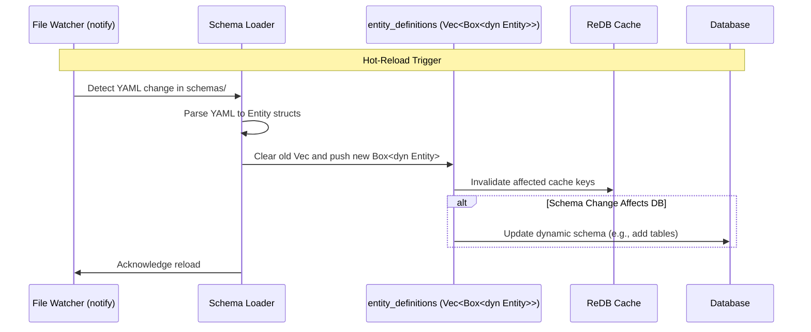

# Entity management

The application treats the YAML files in the `/schema/` folder as the authoritative source of truth
for all entities in the system.  These entities are hot reloaded when files change in the directory
, are deleted, or are loaded.  The entities are parsed from the YAML and stored in a globally accessible Trait-object (Box) called `entity_definitions`.

## Technique

Trait-object (Box<dyn Entity>)
– each element is a boxed value that implements the Entity trait.
- The set of element types may grow, you want true polymorphism, or the structs are large and you don’t want them copied into the enum.

Trait‑object Vec (Box<dyn Entity>)

### Example Implementation

```rust
// Adapted from src-tauri/entities/src/entity.rs and schema_loader.rs
use std::fmt::Debug;

// The common Entity trait for polymorphism.
trait Entity: Debug {
    fn get_id(&self) -> &str;
    fn get_name(&self) -> &str;
    fn validate(&self) -> Result<(), String>;
}

// Concrete entity type: Article
#[derive(Debug)]
struct Article {
    id: String,
    name: String,
    title: String,
    body: String,
}
impl Entity for Article {
    fn get_id(&self) -> &str {
        &self.id
    }
    fn get_name(&self) -> &str {
        &self.name
    }
    fn validate(&self) -> Result<(), String> {
        if self.title.is_empty() {
            return Err("Title cannot be empty".to_string());
        }
        Ok(())
    }
}

// Concrete entity type: User
#[derive(Debug)]
struct User {
    id: String,
    name: String,
    email: String,
}
impl Entity for User {
    fn get_id(&self) -> &str {
        &self.id
    }
    fn get_name(&self) -> &str {
        &self.name
    }
    fn validate(&self) -> Result<(), String> {
        if !self.email.contains('@') {
            return Err("Invalid email format".to_string());
        }
        Ok(())
    }
}

// In schema_loader.rs or main runtime:
// Global storage: static mut entity_definitions: Vec<Box<dyn Entity>> = Vec::new();

// Loading example:
fn load_entities() {
    // Vec of boxed trait objects. Each element lives on the heap.
    let mut entity_definitions: Vec<Box<dyn Entity>> = Vec::new();

    entity_definitions.push(Box::new(Article {
        id: "article_1".to_string(),
        name: "Article".to_string(),
        title: "Sample Article".to_string(),
        body: "Content body".to_string(),
    }));
    entity_definitions.push(Box::new(User {
        id: "user_1".to_string(),
        name: "User".to_string(),
        email: "user@example.com".to_string(),
    }));

    // Dynamic dispatch – e.g., validate all entities
    for entity in &entity_definitions {
        if let Err(e) = entity.validate() {
            println!("Validation error: {}", e);
        }
    }

    // Debug print:
    println!("--- Debug view of entity definitions ---");
    for (i, entity) in entity_definitions.iter().enumerate() {
        println!("{}: id={}, name={}", i, entity.get_id(), entity.get_name());
    }
}
```

#### What’s happening?
Box<dyn Entity> is a fat pointer: it stores a pointer to the heap‑allocated concrete value plus a v‑table pointer for dynamic dispatch.
The vector holds only those fat pointers; each entity can be any type that implements Entity.

- Pros
  - Adding a new entity type never touches existing code – just implement Entity and load from schema.
  - Works even when concrete types are defined in different crates.
- Cons
  - One heap allocation per definition (or use Rc/Arc for sharing).
  - Slight runtime overhead for virtual function calls.

### Schema Loading and Hot-Reload Flow

The entity_definitions are loaded and updated via the schema-manager crate's watcher.



### Schema Examples

For practical examples, refer to the YAML files in the schemas/ directory:
- [snippet.schema.yaml](../../../schemas/snippet.schema.yaml)
- [multi.schema.yaml](../../../schemas/multi.schema.yaml)
- [all_fields.schema.yaml](../../../schemas/all_fields.schema.yaml)

See the [DEVELOPER-GUIDE.md](../DEVELOPER-GUIDE.md) for more on entity schema structure.