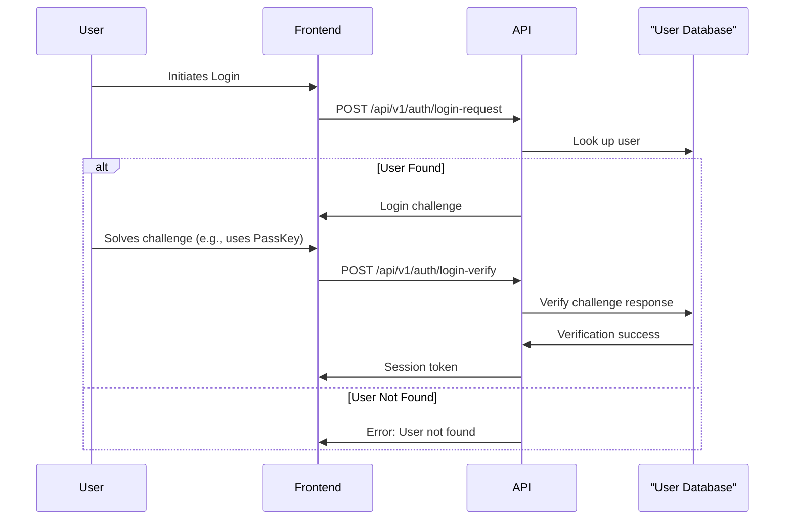

# Authentication

Authentication is the process of verifying a user's identity. Marain CMS will support multiple authentication methods to provide flexibility and security.

## Supported Authentication Methods

-   **PassKeys (WebAuthn):** The primary and most secure authentication method.
-   **Magic Email Links:** For passwordless login.

## Authentication Flow

## Session Management

Sessions are managed using `tower-sessions` with an `sqlx-store`.

-   **Session Store:** `data/user-backend/marain_user.db`
-   **Session Lifetime:** Configurable, defaults to 24 hours.
-   **Security:** Session data is encrypted and secure.

## Implementation Guidelines

The authentication system will be built using the `axum-login` and `tower-sessions` crates.

### `tower-sessions` Configuration
-   **Session Store**: An `SqlxStore` will be configured to use the `marain_user.db` SQLite database. The `tower_sessions` table will be automatically created by the store.
-   **Session Layer**: The `SessionManagerLayer` will be added to the main Axum router to provide session management to all routes.
-   **Encryption**: A private key will be used to encrypt session data, ensuring that session cookies cannot be tampered with on the client side. This key will be loaded from the system configuration.

### `axum-login` Integration
-   **User Store**: A custom user store will be implemented that connects to `marain_user.db`. This store will be responsible for loading user data and verifying credentials (e.g., PassKey challenges, magic link tokens).
-   **Auth Layer**: The `AuthManagerLayer` will be configured with our custom user store and added to the Axum router.
-   **Login/Logout**: The `login` and `logout` functions from `axum-login` will be used in the respective API handlers to manage the user's authentication state within the session.
-   **Authenticated User**: Once logged in, the `AuthSession` extractor can be used in handlers to get access to the currently authenticated user.