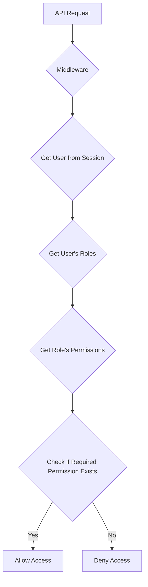

# Authorization

Authorization determines what an authenticated user is permitted to do. Marain CMS will implement a Role-Based Access Control (RBAC) system.

## Roles and Permissions

-   **Roles:** Collections of permissions (e.g., "Administrator", "Editor", "Contributor").
-   **Permissions:** Specific actions that can be performed (e.g., "create_entity", "edit_entity", "delete_user").

## Authorization Logic

## Data Model

The authorization model will be stored in the `marain_user.db` database with the following tables (see [DEVELOPER-GUIDE.md](../DEVELOPER-GUIDE.md#critical-path-configurations--development-workflow) for DB paths and flexibility: SQLite dev, PostgreSQL prod):

-   `users`: Stores user information.
-   `roles`: Stores available roles.
-   `permissions`: Stores available permissions.
-   `user_roles`: Maps users to roles.
-   `role_permissions`: Maps roles to permissions.

For caching roles/permissions in sessions, see ReDB integration in [DEVELOPER-GUIDE.md](../DEVELOPER-GUIDE.md#caching-layer-redb).

## Implementation Guidelines

The authorization logic will be implemented as a custom Axum middleware, integrating with authentication flows from [authentication.md](./authentication.md).

-   **Middleware**: The middleware will extract the `AuthSession` to get the current user.
-   **Permission Check**: It will query the `marain_user.db` to fetch the user's roles and the permissions associated with those roles, using parameterized queries.
-   **Route Protection**: The middleware will be applied to specific routes or routers that require authorization. The required permission(s) will be specified as metadata on the route.
-   **Caching**: User roles and permissions can be cached in the session to reduce database lookups on subsequent requests. The `tower-sessions` `Session` object can be used for this purpose. When a user's roles or permissions are modified, the cache must be invalidated. See [DEVELOPER-GUIDE.md](../DEVELOPER-GUIDE.md#api--request-lifecycle) for API flow with caching.

### Security Best Practices for Authorization
- **Least Privilege:** Assign minimal roles/permissions needed; audit regularly.
- **Parameterized Queries:** Use SQLx for all DB queries to prevent injection.
- **Session Validation:** Invalidate caches on role changes to prevent stale access.
- **Logging:** Log authorization denials to secure.log without user details.
- **Dependencies:** Update axum and tower-sessions; integrate with ULID bridge if IDs are involved.
- **Testing:** Unit test middleware with various role scenarios; E2E for protected routes.